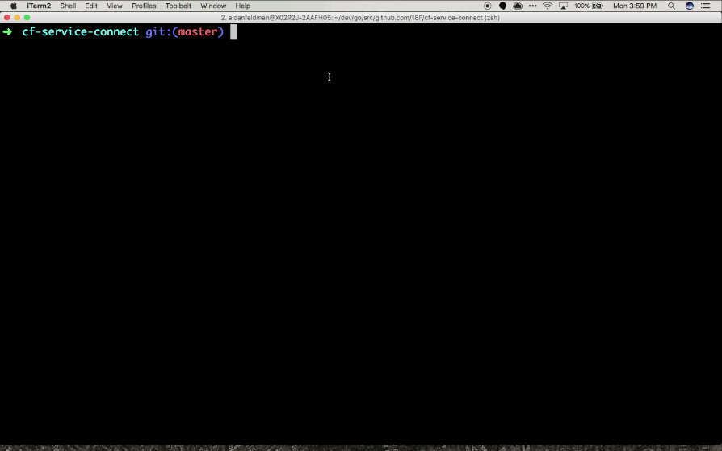

# Cloud Foundry CLI Service Connection Plugin [](https://circleci.com/gh/18F/cf-service-connect) [](https://codeclimate.com/github/18F/cf-service-connect)

This plugin makes it easy to connect to your databases or other Cloud Foundry service instances from your local machine. This condenses the steps listed in [Accessing Services with SSH](https://docs.cloudfoundry.org/devguide/deploy-apps/ssh-services.html) to a single command.



Requires Diego architecture with [SSH enabled](https://docs.cloudfoundry.org/running/config-ssh.html).

## Support

Currently supports (most) service brokers for the following:

* MongoDB (requires [`mongo` shell](https://docs.mongodb.com/getting-started/shell/installation/))
* MySQL (requires [`mysql` CLI](https://dev.mysql.com/doc/refman/8.0/en/installing.html))
* PostgreSQL (requires [`psql` CLI](https://postgresapp.com/documentation/cli-tools.html))
* Redis (requires [`redis-cli`](https://redis.io/topics/quickstart))

## Local installation

1. Install the [Cloud Foundry CLI](https://docs.cloudfoundry.org/cf-cli/install-go-cli.html) v6.15.0 or later.
2. Install this plugin, using the appropriate binary URL from [the Releases page](https://github.com/18F/cf-service-connect/releases).

    ```sh
    cf install-plugin <binary_url>
    # will be of the format
    # https://github.com/18F/cf-service-connect/releases/download/<version>/cf-service-connect.<os>
    # For OSX use cf-service-connect-darwin-xxx

    ```

3. Install the CLI corresponding to your service type (see above).

## Usage

* `app_name` is the name of the app in your space you want to tunnel through.
* `service_instance_name` is the service instance you wish to connect to.

```
$ cf target --organization <org> --space <space>
$ cf connect-to-service <app_name> <service_instance_name>
Finding the service instance details...
Setting up SSH tunnel...
...
mysql>
```

If you get an error such as "connection refused", "error opening SSH connection", or "psql: could not connect to server: Connection refused" this is usually caused by being on a network that blocks the SSH port that this tool is trying to use. Try using a different network, or consider asking your network administrator to unblock the port (typically 22 and/or 2222).

### Manual client connection

If you're using a non-default client (such as a GUI), run with the `-no-client` option to set up your client connection on your own.
